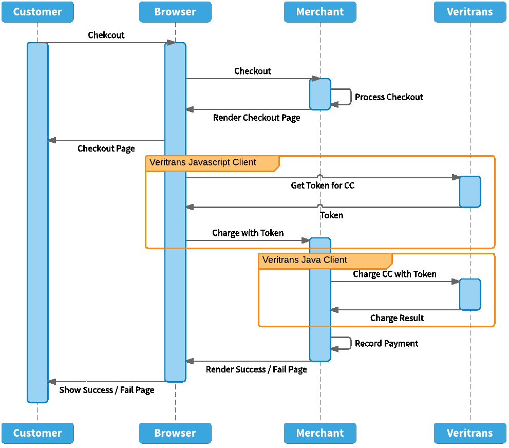
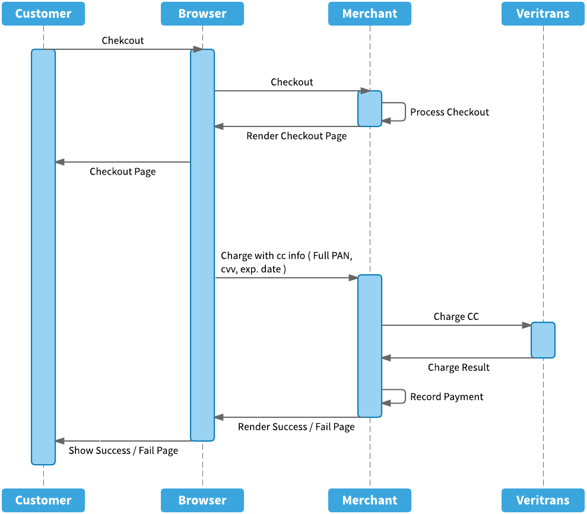
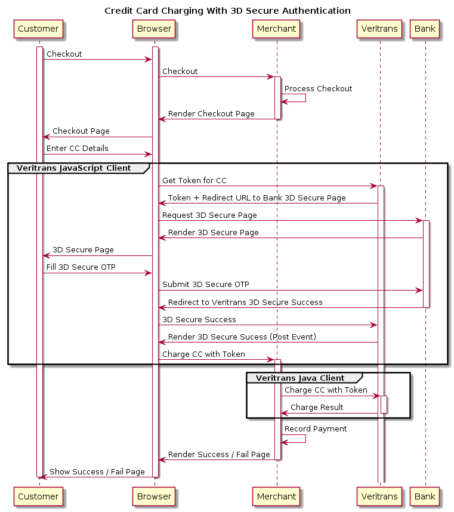
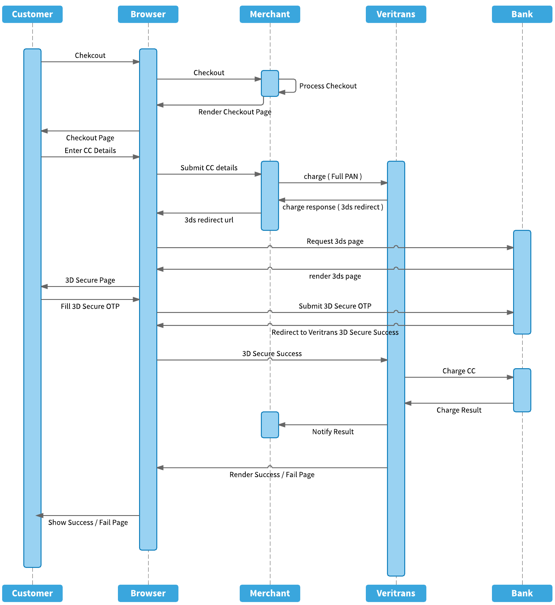
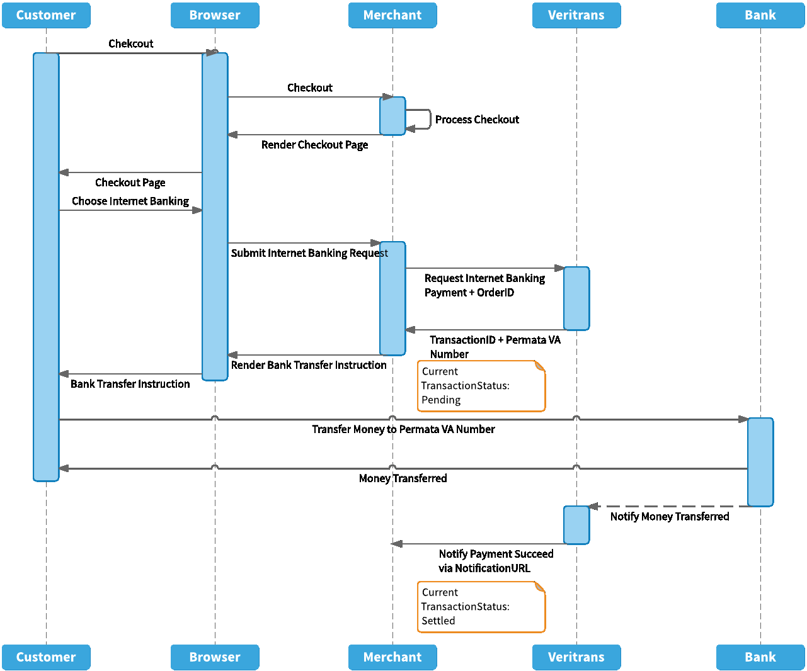
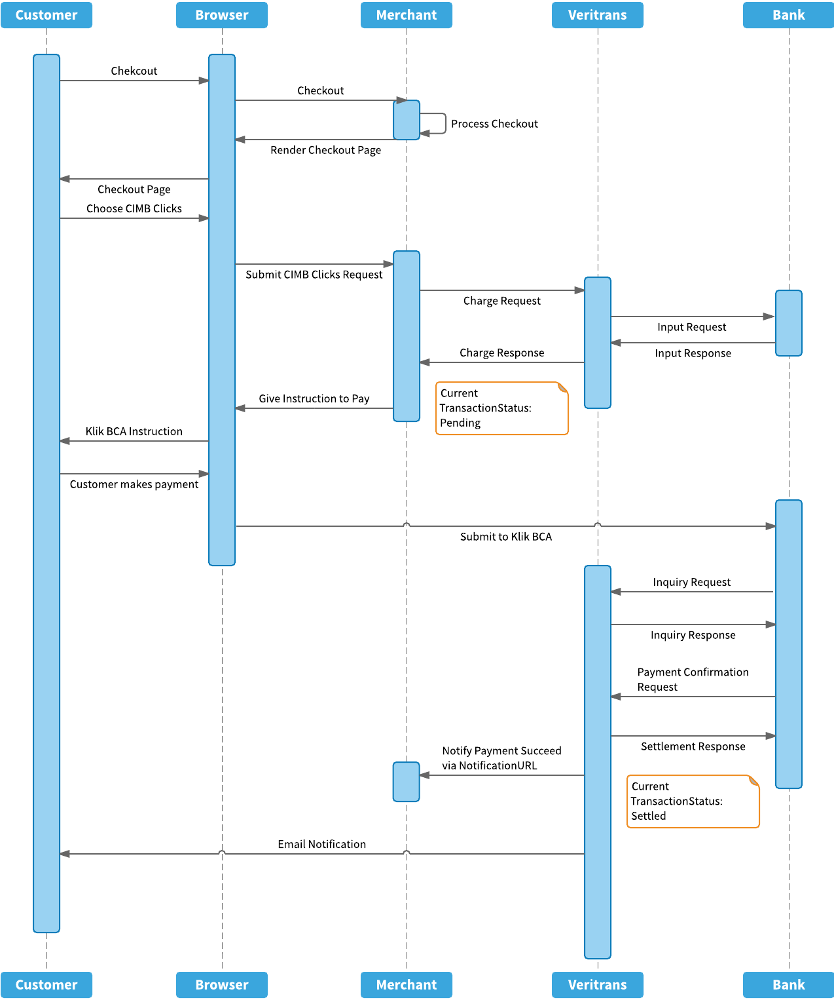
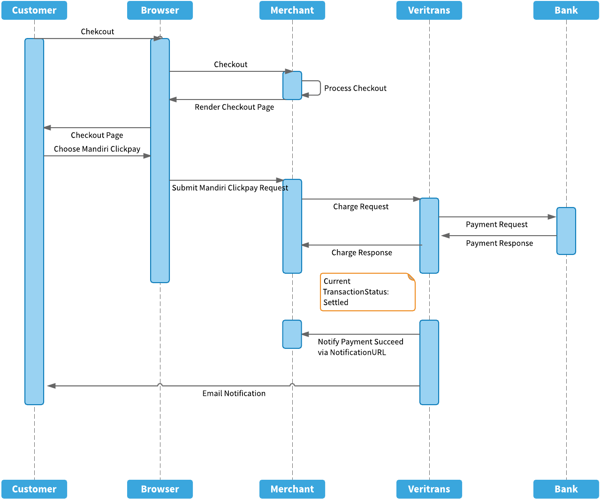
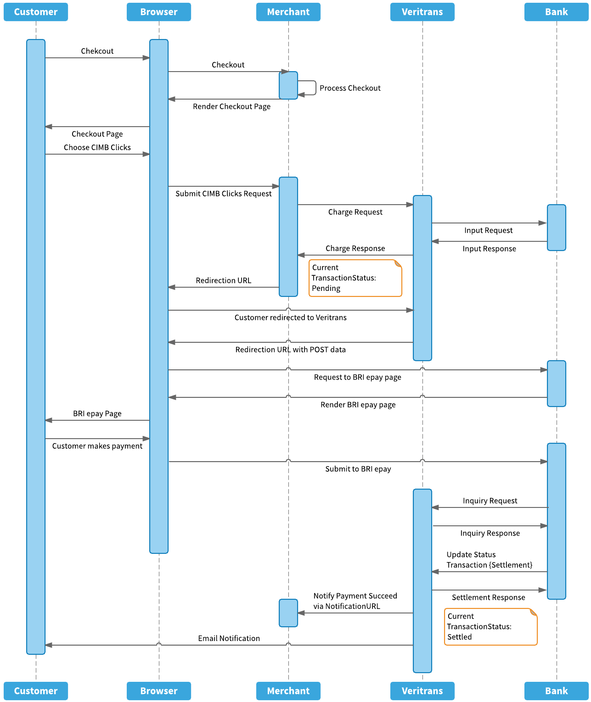

#Process Flow

## Credit Card (One-time Tokenization)

***
## Credit Card (Full PAN)
***`Coming soon`***  
 

***
## Credit Card With 3D Secure (One-time Tokenization)

***
## Credit Card With 3D Secure (Full PAN)
***`Coming soon`***  
 

***
## Bank Transfer via Permata VA

***
## BCA KlikBCA

***
## BCA Klikpay

***
## Mandiri Clickpay

***
## BRI Epay

***
## CIMB Clicks

