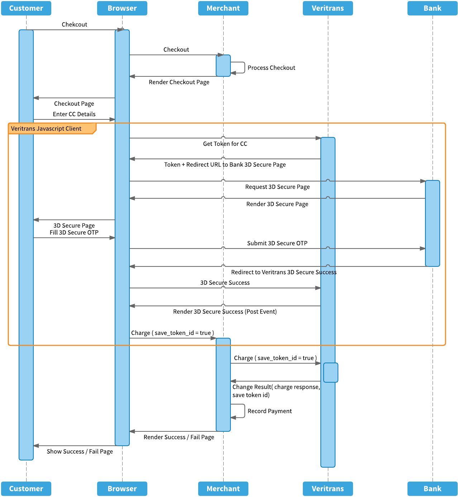

#Process Flow

## Credit Card Charging Without 3D Secure Authentication

***
## Credit Card Charging With 3D Secure Authentication

***
## Credit Card Charging With One-time Tokenization
#### You need to set `save_card_token` flag to `true` for the first credit card transaction and store the `saved_card_token` parameter for next charging  
  
 
#### On next charging, you can directly charge using `saved_card_token` parameter  

***
## Credit Card Charging (Full PAN)
***`Coming soon`***  
 

***
## Bank Transfer via Permata VA

***
## BCA KlikBCA

***
## BCA Klikpay

***
## Mandiri Clickpay

***
## BRI Epay

***
## CIMB Clicks

